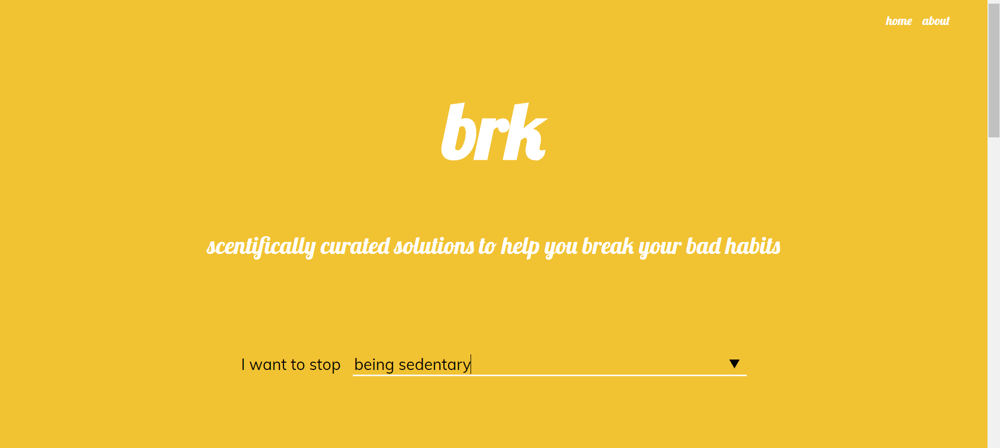
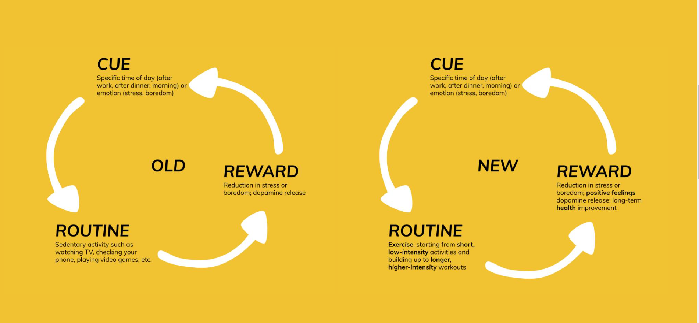

# what is *brk*?
*brk* is based on the idea of the three-part habit loop discovered by researchers at MIT1 and popularized by author Charles Duhigg in his book, The Power of Habit.2 This theory stipulates that most of our actions are habitual, and that these habitual actions form through three components: cue, routine, and reward.

## what are habits?
*brk* is based on the idea of the three-part habit loop discovered by researchers at MIT1 and popularized by author Charles Duhigg in his book, *The Power of Habit*. This theory stipulates that most of our actions are habitual, and that these habitual actions form through three components: cue, routine, and reward.

## the habit loop
A simple neurological loop lies at the core of any habitual behavior: a three-part sequence of cue, routine, and reward.

The cue is the trigger for a habitual behavior to start. It can be a physical object such as food, an emotion (especially negative emotions like stress or fear), or simply a particular time of day or place. The routine is the subconscious behavior triggered by the cue, and the reward is the positive reinforcement your brain receives after completing a habit

Each part of the habit loop strengthens the overall habitual behavior. Over time, continued rewarding of the same routine leads the cue to become more efficient at triggering the habit, leading to more rewards, and more strengthening of the cue. In this way, habits can become extremely powerful in regulating our day-to-day behavior

## changing habits
Because of the habit loop, building new habits and breaking old ones can be difficult. The key is to identify the parts of the habit loop applicable to your habit, and replacing the routine part of the loop with a new routine that responds to similar cues and delivers a similar reward. By replacing the routine, but delivering the same reward, your new habit loop will be reinforced in place of the old one, allowing you to quickly build and strengthen a new, better habit.

## how *brk* helps
*brk* removes the guesswork from this process by providing you with the scientifically-backed information you need to get started immediately on changing your habit. By aggregating information on cues and rewards for common habits, and designing a personalized plan for your habit, *brk* empowers you to learn about your own habits and to jump into breaking up with whatever bad habits you have. 

## demos
*brk* offers customized feedback based on your habit. It illustrates your old habit loop, and how to reshape it to form a new, better habit. The web app also offers a customized 5-step plan, backed by scientific research, on how specifically to tackle building your new habit.

